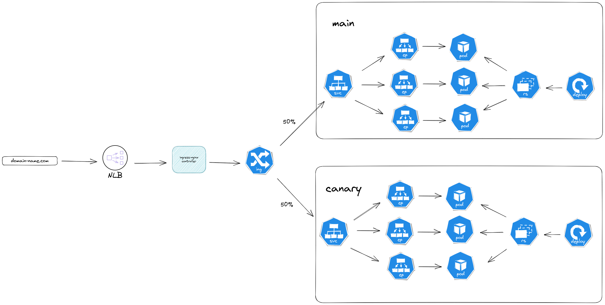

# Canary Deployment ingress-nginx Controller on EKS

Canary deployment on Kubernetes without Service-Mesh ?! This could be possible!

[Ingress Nginx](https://kubernetes.github.io/ingress-nginx/developer-guide/getting-started/) Has the ability to handle canary routing by setting specific annotations.

Ingress Nginx [canary](https://kubernetes.github.io/ingress-nginx/user-guide/nginx-configuration/annotations/#canary) rules could be applied based on:
  - canary-by-header
  - canary-by-cookie
  - canary-weight

Presented here is a Proof of Concept (PoC) that showcasing simple canary-weight 50-50 deployment.

https://github.com/nurhun/canary_deployment_ingress-nginx_controller_on_eks/assets/37078437/f52c43ff-4463-4bb8-b45a-2ff62e0675b4


## Technology Stacks:
  - **Infra**: EKS Cluster
  - **IaC**: Terraform
  - **APP**: Django Rest Framework (DRF) - for backend
  - **APP**: React - for frontend.
  - **Dependency**: Cluster Autoscaler
  - **Dependency**: AWS LoadBalancer Controller
  - **Dependency**: Ingress Nginx Controller
  - **Dependency**: kube-prometheus-stack

## How it works:
* A main deployment of the application with its service and ingress.
* A canary deployment with its service and ingress that will take a weighted amount of requests instead of the main deployment.
* It's essential to ensure that both ingresses share the same host.
    

## Usage:
  1. Initialize terraform and get the required modules
        ```
        terraform init
        ```

  2. Execute the Terraform apply command, which may take approximately 15 minutes to complete:
        ```
        terraform apply
        ```

  3. Upon completion, the assigned IP Address for the ingress will be provided as output. This IP address can be used to access the application via <ip_address>.nip.io.
  4. Browse the app with these credentials, or register a new account,
        ```yaml
        username: admin
        password: admin
        email:    admin@admin.com
        ```

  1. To generate traffic and assess requests, replace <ip_address> with the outputted IP Address in the following command:
        ```
        for i in $(seq 1 1000); do curl -s <ip_address>.nip.io > /dev/null 2>&1 ;done
        ```
  2. Explore the Grafana dashboard to observe the distribution of requests between the primary deployment and the canary deployment. A pre-deployed dashboard is included in the stack.
  3. Cleanup
        ```
        terraform destroy
        ```

## Out of scope:
* non-http protocol.

## TODO:
* Introduce Cert-Manager/AWS Certificate Manager
* Address terraform destroy dependencies/conditions.